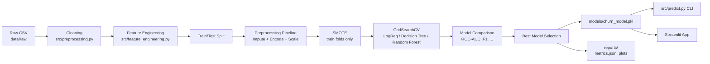
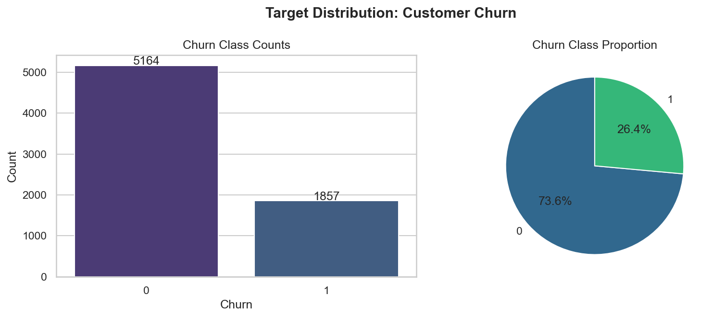
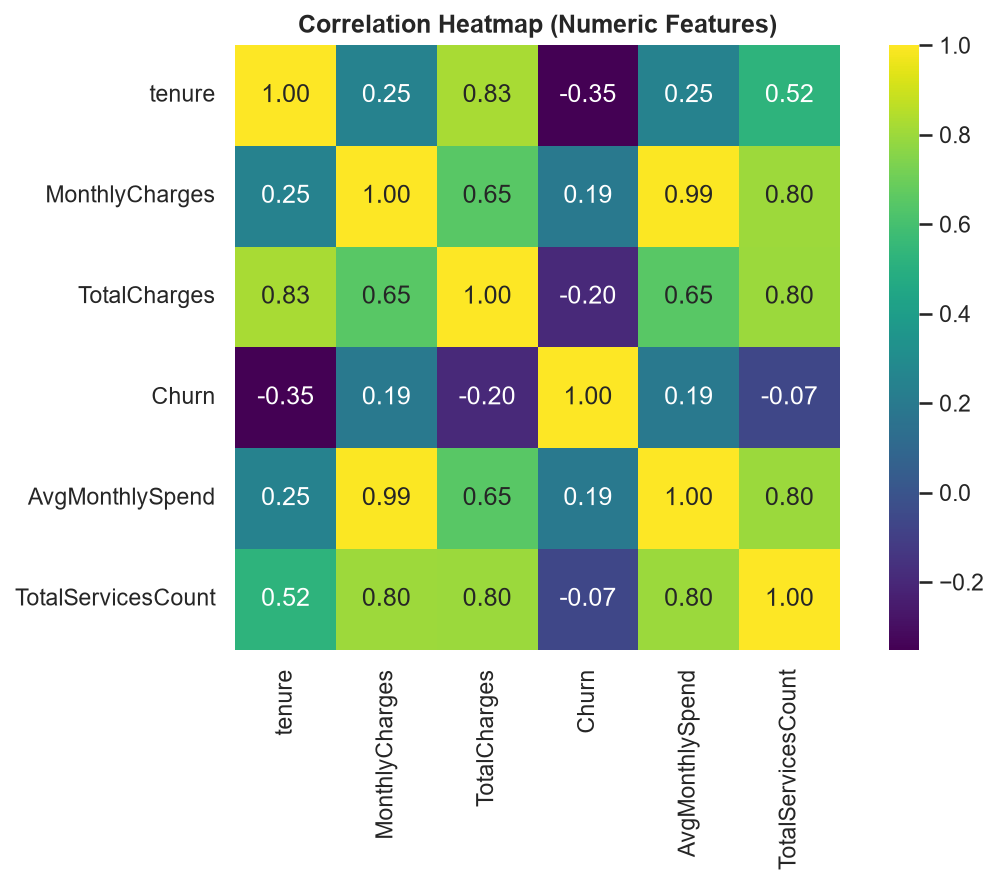
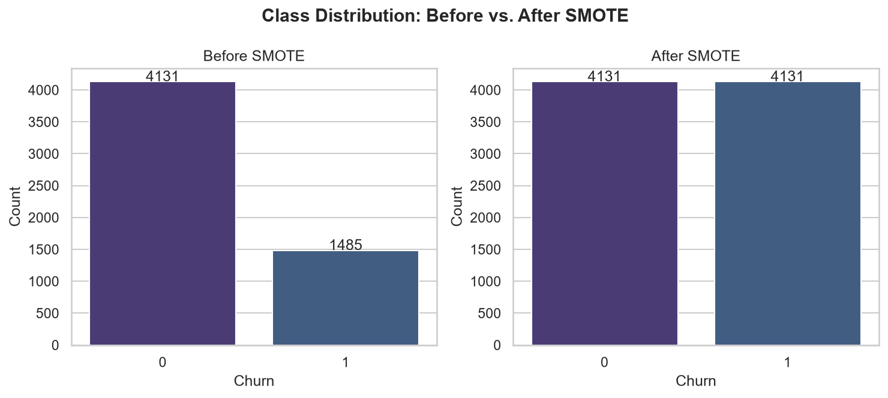
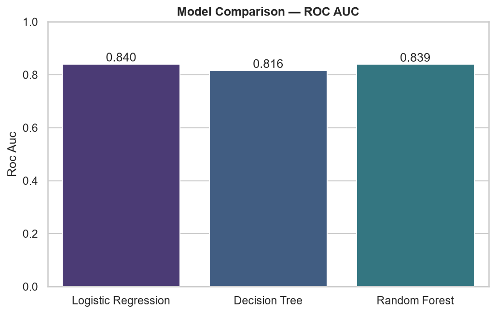
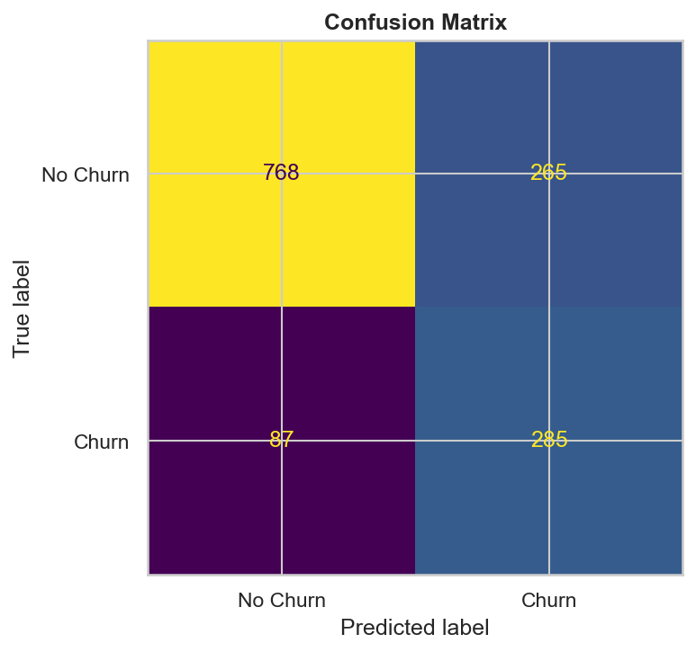
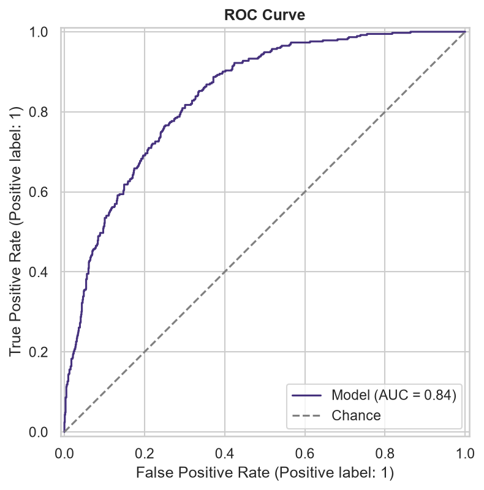
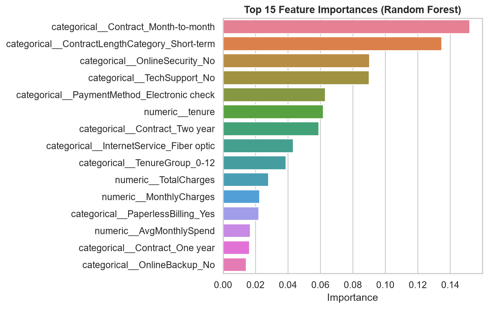

# 📉 Customer Churn Prediction — End-to-End ML Pipeline

[](https://www.python.org/)
[](https://scikit-learn.org/)
[](LICENSE)

A production-quality, end-to-end machine learning pipeline that predicts
whether a telecom customer will **churn**, built on the IBM Telco Customer
Churn dataset. The project covers the full ML lifecycle — EDA, feature
engineering, class-imbalance handling with SMOTE, model tuning and
comparison, evaluation, and deployment via a CLI and an optional Streamlit
app — using a modular, reusable, and reproducible codebase.

---

## Table of Contents

- [Project Overview](#project-overview)
- [Problem Statement](#problem-statement)
- [Dataset](#dataset)
- [Architecture & Workflow](#architecture--workflow)
- [Project Structure](#project-structure)
- [Installation](#installation)
- [Usage](#usage)
  - [Training](#training)
  - [Evaluation](#evaluation)
  - [Prediction (CLI)](#prediction-cli)
  - [Streamlit App](#streamlit-app-optional)
- [Results](#results)
- [Screenshots](#screenshots)
- [Technologies Used](#technologies-used)
- [Future Improvements](#future-improvements)
- [License](#license)

---

## Project Overview

Customer churn — when a customer stops doing business with a company — is
one of the most expensive problems in subscription-based industries.
Acquiring a new customer typically costs far more than retaining an
existing one, so being able to **flag at-risk customers before they leave**
lets a business intervene (targeted offers, proactive support, retention
discounts) and directly protect revenue.

This project builds a complete, reusable ML pipeline that:

- Cleans and explores raw customer data.
- Engineers interpretable, business-meaningful features.
- Corrects for class imbalance with **SMOTE**.
- Trains and tunes three classifiers (Logistic Regression, Decision Tree,
  Random Forest) with `GridSearchCV`.
- Automatically selects the best model by **ROC-AUC**.
- Exposes the trained model through a **CLI prediction script** and an
  optional **Streamlit web app**.

## Problem Statement

> Given a customer's demographic profile, subscribed services, account
> type, and billing information, predict the probability that they will
> churn within the current billing cycle.

This is framed as a **binary classification** problem (`Churn`: Yes/No),
evaluated primarily on **ROC-AUC** (robust to the moderate class imbalance
in the target) alongside precision, recall, and F1.

## Dataset

**IBM Telco Customer Churn** — 7,043 customers, 21 columns, covering:

- **Demographics**: gender, senior citizen status, partner, dependents.
- **Account info**: tenure, contract type, paperless billing, payment
  method, monthly/total charges.
- **Subscribed services**: phone, multiple lines, internet type, online
  security/backup, device protection, tech support, streaming TV/movies.
- **Target**: `Churn` (Yes/No).

### Automatic download

Running any pipeline entry point (`src.data_loader`, `src.train`, the
notebooks) automatically downloads the dataset into `data/raw/` if it is
not already present:

```python
from src.data_loader import load_raw_data
df = load_raw_data()  # downloads to data/raw/Telco-Customer-Churn.csv if missing
```

### Manual download (fallback)

If automatic download fails (e.g. no internet access in your environment),
download the dataset manually from either of these sources and save it as
`data/raw/Telco-Customer-Churn.csv`:

- [IBM Telco Customer Churn on Kaggle](https://www.kaggle.com/datasets/blastchar/telco-customer-churn)
- [IBM Developer — Telco Customer Churn on ICP4D (GitHub mirror)](https://github.com/IBM/telco-customer-churn-on-icp4d)

## Architecture & Workflow



The entire preprocessing + SMOTE + model chain is a single scikit-learn /
imbalanced-learn `Pipeline` object. This guarantees:

- **No data leakage** — SMOTE only ever resamples training folds, never
  validation or test data (enforced by `imblearn.pipeline.Pipeline`).
- **One artifact to ship** — `models/churn_model.pkl` contains
  preprocessing *and* the classifier, so `predict.py` and the Streamlit app
  only need raw customer attributes as input.

## Project Structure

```
customer-churn-prediction-ml/
├── data/
│   ├── raw/                    # Original downloaded dataset
│   └── processed/              # Train/test splits after cleaning + FE
├── notebooks/
│   ├── 01_EDA.ipynb
│   ├── 02_Feature_Engineering.ipynb
│   └── 03_Model_Training.ipynb
├── src/
│   ├── config.py                # Paths, feature lists, hyperparameter grids
│   ├── data_loader.py            # Dataset download + loading
│   ├── preprocessing.py          # Cleaning, encoding, scaling, splitting
│   ├── feature_engineering.py    # Domain-driven engineered features
│   ├── train.py                  # Training, tuning, model selection
│   ├── evaluate.py               # Metrics, feature importance, re-evaluation CLI
│   ├── predict.py                # CLI prediction script
│   ├── utils.py                  # Logging, seeding, JSON I/O
│   └── visualization.py          # All plotting functions
├── app/
│   └── streamlit_app.py          # Optional interactive web app
├── models/
│   └── churn_model.pkl           # Best tuned pipeline (saved with joblib)
├── reports/
│   ├── confusion_matrix.png
│   ├── roc_curve.png
│   ├── feature_importance.png
│   ├── correlation_heatmap.png
│   ├── target_distribution.png
│   ├── model_comparison.png
│   ├── smote_class_distribution.png
│   └── metrics.json
├── requirements.txt
├── README.md
├── .gitignore
└── LICENSE
```

## Installation

```bash
git clone https://github.com/<your-username>/customer-churn-prediction-ml.git
cd customer-churn-prediction-ml

python -m venv .venv
source .venv/bin/activate        # Windows: .venv\Scripts\activate

pip install -r requirements.txt
```

## Usage

### Training

Runs the full pipeline: load → clean → engineer features → split →
preprocess → SMOTE → tune 3 models with `GridSearchCV` → evaluate → select
best by ROC-AUC → save model + reports.

```bash
python -m src.train
```

Artifacts produced:
- `models/churn_model.pkl` — best pipeline (preprocessing + classifier).
- `reports/metrics.json` — full metrics for every candidate model.
- `reports/*.png` — all evaluation and EDA plots.
- `data/processed/train.csv`, `data/processed/test.csv`.

### Evaluation

Re-score the already-trained, saved model against the held-out processed
test split (no retraining):

```bash
python -m src.evaluate
```

### Prediction (CLI)

```bash
python -m src.predict \
  --gender Male --SeniorCitizen 0 --Partner Yes --Dependents No \
  --tenure 12 --PhoneService Yes --MultipleLines No \
  --InternetService "Fiber optic" --OnlineSecurity No --OnlineBackup Yes \
  --DeviceProtection No --TechSupport No --StreamingTV Yes --StreamingMovies Yes \
  --Contract Month-to-month --PaperlessBilling Yes \
  --PaymentMethod "Electronic check" --MonthlyCharges 85.5 --TotalCharges 1020.5
```

Output:

```
=== Churn Prediction ===
Prediction : Churn
Probability: 78.42% chance of churn
```

### Streamlit App (optional)

```bash
streamlit run app/streamlit_app.py
```

Lets you interactively enter customer attributes, get a churn
prediction + probability, and view the feature importance chart.

## Results

Model comparison on the held-out test set (20% stratified split, seed=42),
from an actual run of `python -m src.train` — see `reports/metrics.json`
and `reports/model_comparison.png` for the full report:

| Model               | Accuracy | Precision | Recall | F1 Score | ROC AUC | CV ROC AUC |
|---------------------|:--------:|:---------:|:------:|:--------:|:-------:|:----------:|
| **Logistic Regression** (best) | 0.7495 | 0.5182 | 0.7661 | 0.6182 | **0.8405** | 0.8455 |
| Decision Tree        | 0.7665 | 0.5468 | 0.6909 | 0.6105 | 0.8159 | 0.8221 |
| Random Forest        | 0.7502 | 0.5193 | 0.7608 | 0.6172 | 0.8394 | 0.8446 |

The model with the **highest ROC-AUC** on the test set is automatically
selected and saved to `models/churn_model.pkl` — in this run, **Logistic
Regression** (0.8405 ROC-AUC), narrowly ahead of Random Forest (0.8394).
All three models land within ~2.5 points of ROC-AUC of each other, and all
achieve ~75-77% recall on the minority (churn) class after SMOTE
balancing — a deliberate trade-off, since catching at-risk customers
(recall) matters more than overall accuracy in a retention use case.

**Top churn drivers** (from Random Forest feature importance, see
`reports/feature_importance.png`): contract type, tenure, monthly charges,
internet service type, and online security/tech support subscription.

## Screenshots

| Target Distribution | Correlation Heatmap |
|---|---|
|  |  |

| SMOTE Before/After | Model Comparison |
|---|---|
|  |  |

| Confusion Matrix | ROC Curve |
|---|---|
|  |  |

| Feature Importance |
|---|
|  |

## Technologies Used

- **Python 3.12**
- **pandas / numpy** — data manipulation
- **scikit-learn** — preprocessing pipelines, models, `GridSearchCV`, metrics
- **imbalanced-learn** — SMOTE oversampling
- **matplotlib / seaborn** — visualization
- **joblib** — model persistence
- **Streamlit** — optional interactive web app
- **Jupyter** — exploratory notebooks

## Future Improvements

- Add gradient-boosted models (XGBoost / LightGBM / CatBoost) to the
  comparison.
- Track experiments with MLflow for full run history and model registry.
- Add SHAP-based explainability for individual predictions, not just
  global feature importance.
- Containerize the training + serving pipeline with Docker and expose a
  REST API (FastAPI) alongside the Streamlit app.
- Add automated tests (pytest) for `src/` modules and a CI workflow
  (GitHub Actions) that runs them on every push.
- Monitor for data/model drift in production with periodic retraining.

## License

This project is licensed under the [MIT License](LICENSE).
